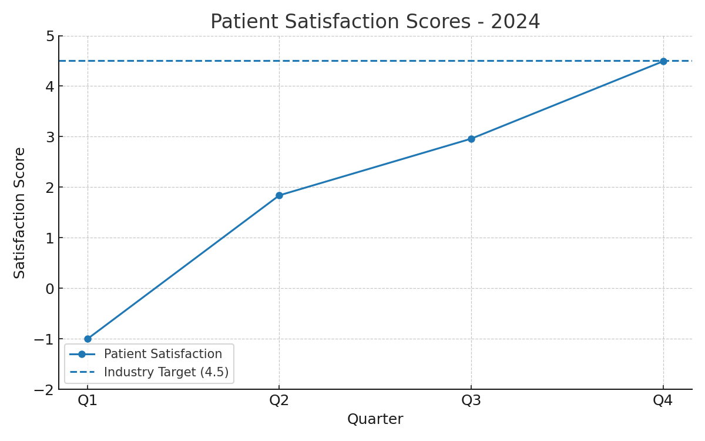

# Patient Satisfaction Data Story (2024)

**Analyst:** 22f3000033@ds.study.iitm.ac.in   
**Tooling:** Jules (ChatGPT Codex), Python, Matplotlib  

---

## Dataset
- **Quarterly Scores:**  
  - Q1: -1  
  - Q2: 1.84  
  - Q3: 2.96  
  - Q4: 4.49  
- **Average (2024):** 2.07  
- **Industry Target:** 4.5  

---

## Key Findings
1. The **average score (2.07)** is significantly below the industry benchmark (4.5).  
2. There is a **positive upward trend** across quarters: from **-1 in Q1** to **4.49 in Q4**, showing substantial recovery.  
3. Despite improvements, only **Q4 approached the target**; earlier quarters heavily dragged down the yearly average.  

---

## Business Implications
- Low patient satisfaction impacts **retention, referrals, and regulatory ratings**.  
- Q1 & Q2 performance suggests systemic issues in **service quality and wait time management**.  
- Sustained Q4 improvements indicate recent changes are working, but consistency is lacking.  

---

## Recommendations
**Solution: improve service quality and wait times** by:  
- Expanding staff training in communication & patient handling.  
- Implementing real-time queue monitoring and appointment optimization.  
- Adding support staff during peak hours and standardizing successful Q4 interventions.  
- Establishing continuous patient feedback loops and monthly dashboard reviews.  

---

## Visualization


> Generated with LLM assistance (Jules / ChatGPT Codex).

---

## Reproducibility
```
pip install -r requirements.txt
python analysis.py
```
